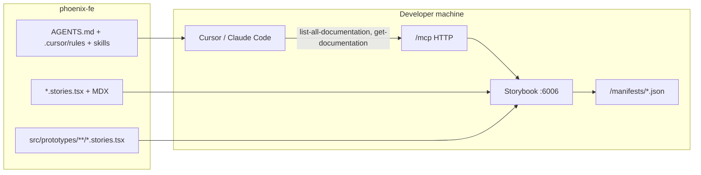

# Feature build plan: Storybook MCP & Designer Skills — AI-Driven UI Mockups (phoenix-fe)

| Field | Value |
|-------|-------|
| **Ticket / ID** | TBD |
| **Status** | Draft |
| **Document type** | Design + Implementation |
| **Implementation status** | Pending repo enrichment |
| **Repo scope** | FE (`phoenix-fe` only) |
| **Dev testing status** | not_started |
| **Dev testing round** | 0 |
| **Author** | agent + user |
| **Repos** | `phoenix-fe` (FE) |
| **Last updated** | 2026-06-01 |
| **Related skills** | `phoenix-fe-implementation-plan`, `phoenix-fe-feature`, `phoenix-scss`, `phoenix-worker` (optional orchestration) |
| **Inspiration** | [designer-skills](https://github.com/Owl-Listener/designer-skills), [Storybook MCP docs](https://storybook.js.org/docs/ai/mcp/overview) |

---

## 1. Overview

### Problem statement

When frontend engineers and product managers use AI assistants (Cursor, Claude Code, Windsurf) to rapidly mock new application screens, LLMs often write generic UI: invented utility-class styling, raw HTML form controls, and layouts that ignore Phoenix’s production component library. That creates refactoring debt and negates the speed benefit of generative AI.

### Goal

Configure a local developer workspace that bridges **real phoenix-fe components** with **design-system constraints** via **Storybook MCP** and **Phoenix-adapted agent instructions** (inspired by designer-skills), so AI-generated mockups are high-fidelity on the first pass and previewable in Storybook.

### Success criteria

- [ ] Prompt: *“Generate a console user profile settings view”* → agent uses real `FormTextField`, `Modal`, `Button.Save`, `MaterialTable` (not raw `<input>` / `<table>`).
- [ ] Layout uses SCSS/BEM + `var(--*)` tokens from `_theme_constant.scss`, not Tailwind or arbitrary hex in JSX.
- [ ] Agent transcript shows MCP `list-all-documentation` / `get-documentation` before writing UI code.
- [ ] One engineer + one PM complete the **5-minute drill** (§8) successfully.
- [ ] Onboarding doc explains how to run Storybook + MCP locally.

### Scope

**In scope**

- Enable Storybook component manifests + `@storybook/addon-mcp`
- Project MCP config (`.mcp.json`), `AGENTS.md`, Cursor rules/skills
- `src/prototypes/` convention + validation script
- Phoenix-specific MDX (layout, patterns, tokens) in Storybook
- README / `docs/ai-prototyping.md` onboarding

**Out of scope**

- Storybook 8.x upgrade (already on **10.0.7**)
- Full install of Owl-Listener designer-skills marketplace (Tailwind-centric; cherry-pick only)
- Chromatic / hosted MCP (optional later phase)
- Production feature modules under `apps/console/modules/` unless explicitly “promote prototype”
- Backend (`phoenix`) changes

### Assumptions & constraints

- Storybook MCP docs toolset is **React-only** (phoenix-fe qualifies).
- Storybook dev server must be running for local MCP (`http://localhost:6006/mcp`).
- Phoenix uses **SCSS + CSS custom properties**, not Tailwind.
- `CLAUDE.md` at repo root remains architecture source of truth; new docs **reference** it, do not duplicate.

---

## 2. Current state (phoenix-fe baseline)

| Area | State | Notes |
|------|--------|-------|
| Storybook | **10.0.7**, `@storybook/react-webpack5`, CRA preset | MCP addon aligns with SB 10 |
| Stories | **~120** `*.stories.tsx` | Strong catalog; manifest quality = docgen + JSDoc |
| Design MDX | `Introduction.mdx`, `Colors.mdx`, `Typography.mdx` | Extend for Phoenix layout/patterns |
| Preview | `QueryClient`, `StaticDataProvider`, `CommonFeaturesProvider`, `SbApiMocker`, `console.scss` | Reuse in prototypes |
| Docgen | `reactDocgen: "react-docgen-typescript"` in `.storybook/main.ts` | Good for manifests |
| Agent docs | Root `CLAUDE.md` | Extend via `AGENTS.md` + skills |
| Cursor skills (repo) | `.cursor/skills/testing/SKILL.md` | Repo tests |
| Cursor skills (personal) | `phoenix-fe-feature`, `phoenix-scss`, `phoenix-worker`, etc. | Add `phoenix-prototype` |
| MCP | Not configured | Greenfield |

**Representative components** (acceptance examples — not generic DS names):

| Need | Phoenix component / path |
|------|---------------------------|
| Actions | `shared/components/button` (`Button.Save`, `Variant`) |
| Overlays | `shared/components/modal`, `alertModal` |
| Forms | `shared/form/fields/*`, `FormContainer` |
| Tables | `shared/components/materialTable` (**required** per `CLAUDE.md`) |
| Chrome | `shared/components/header`, `searchCriteria`, `tag` |

There is no shared `<Avatar />` in `shared/components`; use real primitives or a thin prototype-only wrapper.

**Key paths**

| Purpose | Path |
|---------|------|
| Storybook config | `.storybook/main.ts`, `.storybook/preview.tsx` |
| Story utilities | `src/shared/utils/storybook/` (`SbStoryContainer`, `SbFormWrapper`, `SbApiMocker`) |
| Copy mocks | `.storybook/mocks/copies.ts` |
| Design tokens | `src/assets/styles/_theme_constant.scss`, `_mixin.scss` |
| Shared components | `src/shared/components/`, `src/shared/form/` |

---

## 3. Target architecture



### Output modes

| Mode | Location | Lifecycle | Audience |
|------|-----------|-----------|----------|
| **A. Storybook prototype** | `src/prototypes/**` | Disposable; mock copy keys OK | PM + FE rapid UI |
| **B. Feature scaffold** | `apps/console/modules/...` | Promoted after validation | FE (`phoenix-fe-feature`) |

Default for “mock in 15 minutes” = **Mode A**. Mode B only after explicit “promote to module.”

---

## 4. Implementation phases

### Phase 0 — Manifest health (1–2 days)

**0.1** Enable in `.storybook/main.ts`:

```ts
features: {
  componentsManifest: true,
  experimentalCodeExamples: true // optional
}
```

**0.2** Audit (Storybook running):

- `http://localhost:6006/manifests/components.html`
- `http://localhost:6006/manifests/components.json`
- `http://localhost:6006/manifests/docs.json`

**0.3 Manifest quality backlog**

| Task | Why |
|------|-----|
| JSDoc on props for top ~30 shared components | MCP prop semantics |
| `tags: ['!manifest']` on internal/demo stories | Focused agent index |
| `tags: ["autodocs"]` on discoverable components | Better `get-documentation` |
| Stories for high-use widgets missing coverage | Complete catalog |

**0.4 New/extended MDX** (Storybook sort: Introduction → Colors → Typography → …)

- **Phoenix Layout.mdx** — `consoleHeader`, `--sectionPadding`, `SbStoryContainer`
- **Phoenix Patterns.mdx** — `MaterialTable`, `FormContainer`, `useCopies()`
- **Console vs Reg vs MyExp.mdx** — app SCSS / providers

---

### Phase 1 — Storybook MCP (0.5–1 day)

**1.1** Install:

```bash
yarn exec storybook add @storybook/addon-mcp
```

Add to `.storybook/main.ts` `addons`. Optional PM config:

```ts
{
  name: "@storybook/addon-mcp",
  options: { toolsets: { dev: true, docs: true, test: false } }
}
```

**1.2** Verify: `http://localhost:6006/mcp` after `yarn storybook`

**1.3** Project MCP:

```bash
npx mcp-add --type http --url "http://localhost:6006/mcp" --scope project
```

Commit **`.mcp.json`**. Suggested server name: **`phoenix-fe-storybook`**.

**1.4** Optional later: hosted docs MCP (Chromatic/static) for PMs without local SB.

**1.5** `package.json` scripts (optional):

```json
"storybook:mcp": "yarn storybook"
```

Document: Storybook must be running before UI prompts.

---

### Phase 2 — Agent workspace (1–2 days)

| Artifact | Purpose |
|----------|---------|
| **`AGENTS.md`** | MCP workflow; points to `CLAUDE.md` |
| **`.cursor/rules/phoenix-ui-prototype.mdc`** | Always-on UI/mock constraints |
| **`.cursor/skills/phoenix-prototype/SKILL.md`** | End-to-end prototype story playbook |
| **Personal skill** `~/.cursor/skills/phoenix-prototype/SKILL.md` | Same playbook, invokable from any workspace |

**Agent loop (mandatory)**

1. MCP → `list-all-documentation` → `get-documentation` per component
2. Never invent undocumented props
3. Implement under `src/prototypes/`
4. `get-storybook-story-instructions`; optional `run-story-tests` when configured
5. Self-check: no raw `<table>`, no hardcoded user strings, no theme hex in inline styles

**Phoenix rules (replace Tailwind from designer-skills)**

| Rule | Enforcement |
|------|-------------|
| Styling | SCSS `*.scss`, BEM, `var(--*)` |
| Ban | Tailwind, arbitrary `bg-[#...]` |
| Tables | `MaterialTable` only |
| Copy | `useCopies()` + `I18n.ts`; SB: `.storybook/mocks/copies.ts` |
| Shared edits | No `src/shared/**` without explicit approval |
| React | `CLAUDE.md` patterns |

**designer-skills cherry-pick map**

| Source | Phoenix adaptation |
|--------|-------------------|
| `ui-design` | Phoenix Layout MDX + `phoenix-scss` + `SbStoryContainer` |
| `design-systems` | `_theme_constant.scss`, `Colors.mdx` |
| `prototyping-testing` | Prototype lane + optional interaction tests |
| `interaction-design` | `Variant.ERROR`, `alertModal`, `ErrorField` |

Do **not** install full Owl-Listener marketplace verbatim.

---

### Phase 3 — Prototype lane & validation (1–2 days)

**Directory**

```text
src/prototypes/
  README.md
  console/
    <feature>/
      <Name>.stories.tsx
      <name>.scss   # optional, BEM .prototype*
```

Storybook `title`: **`Prototypes/Console/...`**

**Story conventions**

- `tags: ["autodocs"]` for manifest inclusion
- `layout: "fullscreen"` for console page mocks (override centered default in `preview.tsx`)
- Reuse global preview decorators + `SbApiMocker` / `SbFormWrapper` as needed

**Validation** — `yarn validate:prototype` or `scripts/validate-prototype.sh`:

| Check | Method |
|-------|--------|
| No Tailwind-like classes | ripgrep denylist |
| No raw `<table>` | ripgrep |
| Resolvable imports | tsc on prototype path |
| Optional: imports ⊆ manifest | small node script vs `components.json` |

---

### Phase 4 — Docs & pilot (0.5–1 day)

- README section or `docs/ai-prototyping.md`
- **5-minute drill** (§8)
- Optional: Cursor Automation wired to `phoenix-worker` / ensure Storybook up before prototype prompts

---

## 5. FE work breakdown (for enrichment)

> Enrich with `phoenix-fe-implementation-plan` when implementing in `phoenix-fe`.

| # | Task | Files / areas |
|---|------|----------------|
| 1 | `componentsManifest: true` | `.storybook/main.ts` |
| 2 | `@storybook/addon-mcp` | `.storybook/main.ts`, `package.json` |
| 3 | `.mcp.json` | repo root |
| 4 | `AGENTS.md` | repo root |
| 5 | `.cursor/rules/phoenix-ui-prototype.mdc` | `.cursor/rules/` |
| 6 | `.cursor/skills/phoenix-prototype/SKILL.md` | repo + personal skills mirror |
| 7 | Phoenix Layout/Patterns MDX | `src/**/*.mdx` |
| 8 | `src/prototypes/` + golden story | `src/prototypes/console/...` |
| 9 | `validate:prototype` script | `scripts/`, `package.json` |
| 10 | README onboarding | `README.md` or `docs/ai-prototyping.md` |
| 11 | JSDoc pass on top components | `src/shared/components/**`, form fields |

---

## 6. Acceptance criteria (repo-specific)

### Functional

| Scenario | Pass |
|----------|------|
| Console settings mock | `FormTextField`, `Button.Save`, `Modal`/section SCSS; no raw `<input>` |
| Responsive | SCSS mixins (`minAndMaxMediaQuery`), not ad-hoc JSX pixels |
| Color anti-pattern | Agent uses `var(--error)` / `var(--errorBg)` not `#ff0000` inline |
| List UI | `MaterialTable`, not HTML table |
| MCP discipline | Transcript shows docs tools before codegen |

### Technical (Definition of Done)

- [ ] `@storybook/addon-mcp` + `features.componentsManifest: true`
- [ ] `.mcp.json` committed
- [ ] `AGENTS.md` + `.cursor/rules/phoenix-ui-prototype.mdc` + prototype skill(s)
- [ ] `src/prototypes/` + golden reference story
- [ ] `yarn validate:prototype` (or documented checklist v1)
- [ ] Onboarding doc
- [ ] Manifest debugger reviewed; top shared-component warnings addressed
- [ ] Cross-functional 5-minute drill done

---

## 7. Starter prompt (for README)

```text
You are building a Phoenix FE Storybook prototype (not production module code).

1. Use MCP phoenix-fe-storybook: list-all-documentation, then get-documentation for every component you will use.
2. Create src/prototypes/console/<name>/<Name>.stories.tsx with title "Prototypes/Console/<Name>".
3. Follow CLAUDE.md and phoenix-scss: SCSS + var(--tokens), BEM, MaterialTable for tables, useCopies/mocks for text.
4. Do not use Tailwind or raw HTML form controls.
5. Add the story, run yarn validate:prototype if available, and give the Storybook story id to open.
```

---

## 8. Five-minute cross-functional drill

1. `yarn storybook`
2. Confirm MCP connected in Cursor (`phoenix-fe-storybook`)
3. PM prompt: *“Create Prototypes/Console/DemoParticipantCard using Tag, Button primary, mock copies.”*
4. Verify in browser: story renders, console styling, no Tailwind in DOM
5. Engineer (optional): *“Promote layout to apps/console/modules/... per phoenix-fe-feature.”*

Success = one story in **< 5 minutes** without import rewrites.

---

## 9. Risks & mitigations

| Risk | Mitigation |
|------|------------|
| MCP API churn | Pin addon to Storybook 10.0.7 minor |
| Incomplete manifests for console-only UI | Prioritize `shared/` stories |
| Agents edit `src/shared` | Prototype path + approval gate in rules |
| Slow Storybook | Hosted docs MCP; disable test toolset initially |
| PM without MCP | Pair with engineer or hosted docs only |
| i18n friction | Temporary `I18n` keys tagged `// PROTOTYPE` |

---

## 10. Effort estimate

| Phase | Days | Owner |
|-------|------|--------|
| 0 Manifest + MDX | 1–2 | FE |
| 1 MCP | 0.5–1 | FE |
| 2 Agent config | 1–2 | FE + DX |
| 3 Prototype + validation | 1–2 | FE |
| 4 Docs + pilot | 0.5–1 | FE + PM |

**Total:** ~4–8 engineering days + ongoing manifest hygiene.

---

## 11. Deferred / dropped from original draft

| Original | Phoenix decision |
|----------|------------------|
| Storybook 8.x+ | **Skip** — on 10.0.7 |
| `.cursorrules` only | `AGENTS.md` + `.cursor/rules` + skills |
| Tailwind tokens | `_theme_constant.scss` + `phoenix-scss` |
| Generic Avatar/Card/InputField | Button, Modal, FormTextField, MaterialTable |
| Full designer-skills install | Cherry-pick into MDX/skills |

---

## 12. Suggested JIRA subtasks

1. Enable `componentsManifest` + manifest audit
2. Add `@storybook/addon-mcp` + `.mcp.json`
3. `AGENTS.md` + rules + `phoenix-prototype` skill
4. Phoenix Layout/Patterns MDX
5. `src/prototypes` + golden story + `validate:prototype`
6. README + PM/FE pilot

---

## 13. Implementation handoff

When ready to implement:

1. Open **`phoenix-fe`** in Cursor.
2. `@phoenix-fe-implementation-plan` + attach this file — enrich §5 with audited paths.
3. Implement per enriched plan; use `@phoenix-fe-feature` and `@phoenix-scss` for feature/promotion work.
4. Optional: `@phoenix-worker` if treating as a tracked delivery (FE-only scope).

**Plan file path:**

```text
~/.cursor/skills/docs/feature-plans/storybook-mcp-ai-ui-mockups-build-plan.md
```
